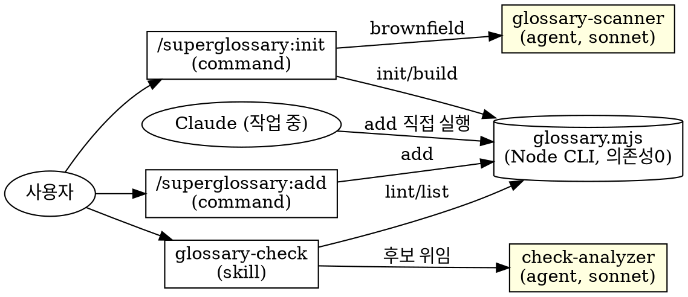

# superglossary v0.2.0 설계: 용어사전 커맨드·스킬·서브에이전트

- 작성일: 2026-06-20
- 대상 버전: `0.1.0` → `0.2.0`
- 참고: 강의 「김영한의 실전 데이터베이스 - 설계 1편, 현대적 데이터 모델링 완전 정복」의 '용어 사전' 챕터

---

## 1. 배경과 목표

LLM은 세션마다 컨텍스트가 초기화되어 같은 개념을 매번 다르게 번역할 수 있다(예: 청구 → claim / billing / charge). 사람 팀에서도 같은 개념을 member / customer / user로 제각각 부르면 유지보수 비용과 신규 인원의 파악 비용이 폭증한다.

이 플러그인은 **프로젝트 용어사전을 레포 안 파일로 관리**하고, Claude Code가 네이밍 시 **항상 같은 영문명**을 쓰도록 만든다. 용어사전은 비즈니스 용어와 물리 데이터 이름을 매핑하는 "프로젝트 용어의 헌법"이다.

### 핵심 설계 원칙

- **소스는 레포 안 파일.** 노션/시트/외부 MCP를 쓰지 않는다 — 네트워크 호출·버전 불일치·팀원별 설정 비용을 피한다.
- **2단 로딩.** 압축 매핑표(`core.md`)는 `.claude/CLAUDE.md`의 `@import`로 **상시 로드**, 상세 설명(`terms.md`)은 필요할 때만 찾는 **온디맨드**.
- **상시 컨텍스트 비용 ≈ 0.** 매 턴 로드되는 건 각 프로젝트의 `core.md`뿐. 플러그인 자체는 설정·등록·검사 기능만 제공한다.
- **작업 흐름을 끊는 게이트 금지.** "반드시 확인 후 진행" 같은 차단 동작을 넣지 않는다. 새 용어는 직접 사전에 추가하고 같은 diff에 포함해 흐름을 유지한다.
- **결정론은 스크립트, 의미 판단은 LLM.** 중복 검사·빌드·토큰 추출 등 결정론적 작업은 스크립트가 정확·빠르게 처리하고, LLM은 동의어 판단·복합어 분해 같은 의미 작업만 맡는다.
- **도구 스스로 원칙을 지킨다.** 용어사전이 "축약어 통제"를 권하므로, 스키마 필드명도 약어 없이 풀어쓴다(자기일관성).
- **YAGNI.** 초기엔 최소 스키마로 시작한다(분류 없이 단일어 매핑). 용어가 많아져 가치가 생길 때 분류 등을 도입한다.

---

## 2. 핵심 설계 결정 (의사결정 기록)

| # | 결정 | 선택 | 근거 |
|---|---|---|---|
| 1 | 아키텍처 | 하이브리드 (커맨드 + 스킬 + 서브에이전트) | init/add는 결정론적이라 커맨드, check는 의미 분석이라 스킬+서브에이전트 |
| 2 | 실행 스크립트 언어 | **Node** (`glossary.mjs`, 의존성 0) | OS 불문 단일 명령(`node`), JSON 네이티브, Claude Code 플러그인 생태계 표준 |
| 3 | 서브에이전트 모델 | **sonnet** 고정 | 의미 분석에 충분 + 검사·스캔 반복 실행에 비용·속도 유리. superpowers의 "least powerful model that works" 원칙과 일치 |
| 4 | v1 범위 | 표준 (init+add+check 전부) | 자동화(pre-commit/CI)는 README 가이드만, 기본 설치 미포함(흐름 차단 방지) |
| 5 | 서브에이전트 구현 | **선언적 `agents/*.md`** | 역할·모델이 고정이라 1급 컴포넌트로 선언하는 게 깔끔(plugin validate 인식, /agents 노출, 재사용) |
| 6 | 스크립트화 범위 | **적극(lint 포함)** | check를 lint(결정론 후보 추출) + analyzer(의미 확정) 하이브리드로 → 정확도↑ 토큰↓ |
| 7 | 상시 로드 위치 | **`.claude/CLAUDE.md`** | 공식 문서상 `./CLAUDE.md`와 동등하게 자동 로드 + git 팀 공유 |
| 8 | 데이터 위치 | **`.claude/superglossary/`** | 플러그인명과 일치해 소유권 명확·충돌 없음. import가 `@superglossary/core.md`로 단순 |
| 9 | 스키마 필드명 | **풀어쓰기** (`korean`/`english`/`abbreviation`) | 용어사전 도구가 축약 통제 원칙과 자기일관 |
| 10 | Claude 자율 추가 | **CLI + CLAUDE.md 규칙** | add 로직이 CLI에 있어 Claude가 Bash로 직접 실행. 커맨드는 사용자용 UX |
| 11 | 기존 프로젝트 대응 | **혼용 리포트 + 표준 선정** | brownfield의 용어 혼용을 빈도와 함께 제시, 표준만 등록(자동 리네임 안 함) |
| 12 | 분류(category) | **v1 제외 (향후 도입)** | 초기엔 단순화. 단일어 중심이라 용어 수가 적게 유지됨. 강의는 분류를 쓰나 가치가 생길 때 도입 |
| 13 | 용어 CRUD | **add/update/remove (CLI)**, 커맨드는 add만 | update/remove는 순수 결정론이라 CLI 직접. add만 복합어 분해 의미판단이 있어 커맨드로 노출 |
| 14 | relatedElements 타입 | **문자열 배열** | 콤마 구분 문자열보다 구조적이고 파싱 불필요 |

### 서브에이전트 유효성 검토 (참고)

`requesting-code-review`(superpowers)는 우리 check와 목적이 동형이며("completing tasks ... before merging"), 단일 분석 작업을 **명시적으로 서브에이전트에 위임**한다. 위임의 1순위 가치는 *비용 절감이 아니라 컨텍스트 격리*다 — 리뷰어는 메인의 사고 과정이 아닌 결과물만 보고, 메인 컨텍스트를 보존한다. 우리는 이 패턴을 따르되, superpowers가 `general-purpose + 프롬프트 템플릿`을 쓰는 이유(작업별 동적 모델, 매번 다른 프롬프트)가 우리에겐 없으므로 선언적 `agents/*.md`를 택한다.

---

## 3. 용어사전 운영 원칙 (도메인 지식 — 모든 컴포넌트·생성 문서에 반영)

강의 '용어 사전' 챕터에서 정리한 원칙이다. 커맨드 안내 문구, 에이전트 시스템 프롬프트, 생성 문서에 일관되게 녹인다.

1. **단일어(Single Word) 중심 — 가장 중요.** 복합어를 통째로 등록하지 않는다. 최소 단위 단일어만 등록하고 조합한다(회원=member, 식별자=id → 회원id = `member_id`). 복합어 등록은 ①사전 비대화 ②일관성 붕괴(`member_num` vs `member_id`) ③재사용성 저하를 부른다.
2. **축약어 통제.** 축약어 남발 금지(`mem_reg_dt` ✗ → `member_register_datetime` ✓). 축약어는 **사전에 등록된 것만** 사용(`id`, `dt`, `addr`, `ship` 등). 미등록 축약은 위반.
3. **비즈니스 특화 용어 포함.** SKU, PNL, MAU, ARPU 같은 도메인 약어도 정의해 개발–기획 공통 언어(Ubiquitous Language)를 만든다.
4. **실무 메모 기록.** 예약어 충돌(`order` → 테이블명 `orders`), 문맥별 의미 차이(`product.price`=현재가 vs `order_item.order_price`=주문시점가) 같은 주의사항을 설명란에 남긴다.
5. **살아있는 문서.** 작업 중 새 용어가 등장할 때마다 추가하며 성장한다. 변경 이력은 git이, 합의는 PR 리뷰가 담당한다.

---

## 4. 아키텍처

| 컴포넌트 | 진입 | 모델 | 역할 |
|---|---|---|---|
| `commands/init.md` | `/superglossary:init` | 세션 | 사전 스캐폴딩 + `.claude/CLAUDE.md` 연결. greenfield/brownfield 분기 |
| `commands/add.md` | `/superglossary:add` | 세션 | 단일어 등록(스크립트 위임). 사용자 명시 호출용 |
| `skills/glossary-check/SKILL.md` | 자연어/자동 | 세션 | 진입점 — 대상 결정 후 check-analyzer dispatch |
| `agents/check-analyzer.md` | check 스킬이 호출 | **sonnet** | lint 후보를 받아 코드↔사전 양방향 의미 확정 |
| `agents/glossary-scanner.md` | init이 호출(선택) | **sonnet** | 기존 코드베이스 단일어 후보 추출 + 용어 혼용(변형·빈도) 탐지 |
| `templates/` | init이 복사 | — | `glossary.mjs`, 초기 `glossary.json` 원본 |

> Claude 자율 추가는 별도 컴포넌트가 아니다. add 로직이 CLI(`glossary.mjs add`)에 있으므로, Claude는 작업 중 Bash로 직접 호출한다(§7, §8).



---

## 5. 데이터 모델

### 위치

```
.claude/
├── CLAUDE.md              # @superglossary/core.md import + 네이밍 규칙
└── superglossary/
    ├── glossary.json      # SSOT — 사람/스크립트가 편집하는 유일한 원천
    ├── core.md            # [생성물] 상시 로드용 압축 매핑표
    ├── terms.md           # [생성물] 온디맨드 상세 참조
    └── glossary.mjs       # CLI (init/build/add/list/lint), 의존성 0
```

### `glossary.json` 스키마

`abbreviations[]` 별도 배열을 두지 않는다. 강의 표에서도 SKU·PNL 등 비즈니스 약어가 같은 표에 들어가므로, **모두 `terms[]`의 한 행**으로 통합한다. 분류(`category`)는 v1에서 두지 않는다(§2 #12). 스키마 키는 약어 없이 풀어쓴다.

```jsonc
{
  "terms": [
    {
      "korean": "식별자",              // 명칭(한글)
      "english": "identifier",        // 전체 영문명
      "abbreviation": "id",           // 축약어, 없으면 null
      "description": "데이터를 고유 식별하는 값. {엔티티}_id 형식",
      "relatedElements": ["member_id", "product_id"]  // 선택, 문자열 배열
    },
    {
      "korean": "재고관리 단위",
      "english": "Stock Keeping Unit",
      "abbreviation": "SKU",
      "description": "재고 관리 최소 단위. 같은 상품도 옵션(색상·사이즈)이 다르면 SKU가 다름"
    }
  ]
}
```

강의 표 컬럼과의 대응(분류 제외): 명칭=`korean`, 전체영문명=`english`, 축약어=`abbreviation`, 설명=`description`, 관련 시스템 요소=`relatedElements`.

### 초기 `glossary.json` (init이 생성)

```jsonc
{
  "terms": [
    { "korean": "식별자", "english": "identifier", "abbreviation": "id", "description": "데이터를 고유 식별하는 값. {엔티티}_id 형식" },
    { "korean": "일시", "english": "datetime", "abbreviation": "at", "description": "날짜와 시각. created_at 처럼 _at 접미사로 사용" },
    { "korean": "이름", "english": "name", "abbreviation": null, "description": "대상을 지칭하는 명칭" }
  ]
}
```

---

## 6. `glossary.mjs` — 단일 CLI (Node, 의존성 0)

Node 내장(`node:fs`, `node:path`, `node:process`)만 사용한다. npm install 불필요. 사용자 프로젝트 실행은 `node .claude/superglossary/glossary.mjs <subcommand>` 단독이며 pnpm·package.json과 무관하다.

| 서브커맨드 | 역할 | 결정론/멱등 |
|---|---|---|
| `init` | 초기 `glossary.json` 생성(없을 때) → `build` → `.claude/CLAUDE.md` 블록 삽입(존재·중복 검사). *`glossary.mjs` 파일 자체 배치는 init 커맨드가 templates에서 복사* | 멱등(이미 있으면 보존) |
| `build` | `glossary.json` → `core.md`·`terms.md` 전량 재생성 | 멱등·결정론 |
| `add <korean> <english> [abbreviation] [--desc "..."] [--related ...]` | 중복·충돌 검사(korean/english/abbreviation) → `glossary.json` 추가 → `build` | 결정론. 충돌 시 비정상 종료 + 기존 항목 출력 |
| `update <korean> [--english E] [--abbreviation A] [--desc D] [--related ...]` | `korean`으로 찾아 지정 필드만 갱신 → `build`. 없으면 비정상 종료 | 결정론 |
| `remove <korean>` | `korean`으로 찾아 삭제 → `build`. 없으면 비정상 종료 | 결정론 |
| `list` / `lookup <q>` | 등록 용어 조회(에이전트·사용자용) | 결정론 |
| `lint <files...>` | 코드 식별자 토큰 추출(camelCase/snake_case 분해) + 사전 대조로 **후보** 산출(미매칭 토큰, 미등록 축약어 후보). 정규식 수준이면 충분(AST 파싱은 비목표) | 결정론. 의미 확정은 하지 않음 |

> 용어 식별 키는 `korean`이다. `add`가 같은 `korean`에 다른 `english`를 막으므로 유일 키로 동작하며, `update`/`remove`는 이 키로 대상을 찾는다. (`relatedElements`는 콤마로 받아 배열로 저장)

### 생성 규칙

- 두 생성물 상단에 HTML 주석 `<!-- 이 파일은 glossary.json에서 자동 생성됩니다. 직접 편집하지 마세요. (glossary.mjs build) -->` 를 넣는다. (HTML 주석은 CLAUDE.md 컨텍스트 주입 시 제거되어 토큰 0)
- **`core.md`** (상시 로드, 토큰 최소화): `korean | english | abbreviation` 마크다운 표 + 상단에 단일어·축약어 규칙 주석. `description` 제외. **정렬은 `korean` 가나다순**(`localeCompare('ko')`)으로 결정론·멱등 보장. 200줄 근접 시 분할 안내 주석 출력.
- **`terms.md`** (온디맨드, 전체): `description`·`relatedElements` 포함 용어표(`korean` 가나다순 단일 표). 비즈니스 약어도 같은 표.
- **멱등성**: 같은 `glossary.json`으로 `build`를 두 번 실행하면 출력이 동일(git diff 없음).

---

## 7. 컴포넌트 상세

### `commands/init.md`
- frontmatter: `description`, `argument-hint`, `allowed-tools: Bash, Read, Write, Edit, Task, AskUserQuestion`
- 동작:
  1. **스캐폴딩**: `${CLAUDE_PLUGIN_ROOT}/templates/`의 `glossary.mjs`·초기 `glossary.json`을 `.claude/superglossary/`로 배치하고 `node .claude/superglossary/glossary.mjs init` 실행 → `core.md`·`terms.md` 생성 + `.claude/CLAUDE.md` 블록 삽입(중복 방지). 기존 파일은 보존.
  2. **모드 분기 (greenfield vs brownfield)**:
     - **greenfield**(코드가 거의 없음): 초기 단일어로 시작. 끝.
     - **brownfield**(기존 코드 존재): "용어 후보와 혼용을 스캔할까요?"를 먼저 묻고, 동의 시 `glossary-scanner` 서브에이전트 dispatch.
  3. **brownfield 스캔 결과 처리**: scanner가 **(a) 단일어 후보**와 **(b) 혼용 리포트**(같은 개념에 쓰인 영문 변형 + 사용 빈도)를 반환 → init이 제시 → 사용자가 후보를 선별하고 **혼용 건은 표준 1개를 선정** → `glossary.mjs add`로 등록 → 재빌드. **자동 리네이밍은 하지 않는다**(비표준 사용처는 이후 `glossary-check`가 위반으로 보고).

### `commands/add.md`
- frontmatter: `description`, `argument-hint: <한글> <영문> [축약어] [-- 설명]`, `allowed-tools: Bash, Read`
- 동작:
  1. **복합어 감지(LLM)**: 입력이 복합어면 단일어 분해를 안내(예: "회원번호 member_num" → "회원=member 등록됨, 번호 대신 식별자=id로 `member_id` 권장"). 분해된 단일어 중 미등록인 것만 등록.
  2. **등록(스크립트)**: `node .claude/superglossary/glossary.mjs add ...` 호출. 중복·충돌 검사와 빌드는 스크립트가 결정론적으로 수행. 충돌 시 스크립트가 기존 항목을 출력하면 LLM이 사용자에게 설명.
- 이 커맨드는 **사용자 명시 호출용**이다. Claude의 자율 추가는 커맨드를 거치지 않고 §8 규칙에 따라 CLI를 직접 실행한다.

### `skills/glossary-check/SKILL.md`
- frontmatter: `name: glossary-check`, `description`(트리거: "작업 완료 후 / 커밋 전 / 코드 네이밍을 용어사전과 대조할 때")
- 동작:
  1. 대상 결정: 인자 없으면 `git diff`(staged+unstaged), 경로 주면 그 범위.
  2. `node .claude/superglossary/glossary.mjs lint <files>` 로 후보(미매칭 토큰·미등록 축약어 후보)를 결정론적으로 추출.
  3. 좁혀진 후보 + `glossary.mjs list` 결과를 `check-analyzer` 서브에이전트에 넘겨 의미 확정.
  4. 결과 보고(위반 + 권장 수정안 + `/superglossary:add` 후보 표). **자동 수정은 하지 않는다.**

### `agents/check-analyzer.md`
- frontmatter: `name`, `description`, `model: sonnet`, `tools: Read, Grep, Glob, Bash`
- 시스템 프롬프트: 입력으로 받은 lint 후보와 사전을 바탕으로 **양방향** 판단 — 코드→사전(등록 개념을 다른 영문으로 사용, 예: 사전 member ↔ 코드 customer / 미등록 축약어) + 사전→코드(새로 등장한 미등록 용어 후보). 출력은 위반 목록 + 권장 수정안 + 추가 후보 표. 기존 모듈 컨벤션 우선 룰을 존중하고 자동 수정·임의 리네이밍은 제안하지 않는다.

### `agents/glossary-scanner.md`
- frontmatter: `name`, `description`, `model: sonnet`, `tools: Read, Grep, Glob`
- 시스템 프롬프트:
  - **단일어 후보 추출**: 엔티티/테이블/도메인 클래스·컬럼명을 스캔해 단일어 중심 후보를 표로 반환(복합어는 단일어로 분해).
  - **혼용 탐지**: 같은 개념에 쓰인 영문 변형과 사용 빈도를 수집해 혼용 리포트로 반환(예: 사용자 → `user`×120 / `member`×45 / `customer`×12). 표준 선정은 사용자 몫이므로 강요하지 않고 빈도만 제시.

### `templates/`
- `glossary.mjs` (CLI 원본), 초기 `glossary.json`. init이 사용자 프로젝트로 복사.

---

## 8. `.claude/CLAUDE.md` 통합

init은 `.claude/CLAUDE.md`에 아래 블록을 추가한다(이미 `## 용어 사전` 섹션이 있으면 중복 추가하지 않음, 파일이 없으면 생성). import 상대경로는 import를 포함한 파일(`.claude/CLAUDE.md`) 기준이므로 `@superglossary/core.md`.

```markdown
## 용어 사전
@superglossary/core.md

- 클래스/변수/함수/컬럼/테이블 등 모든 네이밍은 위 표의 영문명만 사용한다. 축약어는 표에 등록된 것만 허용한다.
- 표에 없는 단일어가 필요하면 임의로 짓지 말고, Claude가 직접 `node .claude/superglossary/glossary.mjs add <korean> <english> [abbreviation]`로 추가한다(사용자는 `/superglossary:add`도 사용 가능). 복합어는 단일어로 분해해 등록하고, 변경은 같은 diff에 포함한다.
- 용어 수정·삭제가 필요하면 `node .claude/superglossary/glossary.mjs update <korean> ...` 또는 `remove <korean>`을 사용한다(둘 다 자동 재빌드).
- 기존 모듈 수정 시 그 모듈의 기존 컨벤션을 우선하고, 신규 코드에는 사전을 우선한다. 임의 리네이밍은 하지 않는다.
- 비즈니스 의미·주의사항이 필요하면 `.claude/superglossary/terms.md`를 찾는다. `core.md`·`terms.md`는 생성물이므로 직접 편집하지 않는다(원천은 `glossary.json`, 직접 편집 시 `glossary.mjs build` 실행).
- 워크플로: 작업 시작 전 핵심 개념 정렬 → 작업 중 검색 없이 작성하고 빈 용어만 추가 → 완료 후 `glossary-check`로 검토.
```

> 자율 추가의 근거가 이 규칙이다. add 로직이 CLI에 있으므로 Claude는 작업 중 표에 없는 단일어를 만나면 위 규칙에 따라 Bash로 직접 등록한다. (CLAUDE.md는 context이지 강제 설정이 아니므로 절대 보장은 아니다 — 흐름 유지 원칙상 hook으로 강제하지 않는다.)

---

## 9. 권장 워크플로우 (README·커맨드 안내에 반영)

핵심 원칙: **작업 중에는 용어를 검색하지 않는다.** `core.md`가 상시 로드되므로 조회 없이 영문명을 아는 상태로 코드를 쓴다. 검색·검토는 작업 경계로 몰아 마찰을 0에 가깝게 만든다.

1. **시작 전(앞단 정렬)**: 큰 기능 전, 다룰 핵심 개념만 사전과 맞춘다. 잘못된 네이밍이 코드에 퍼진 뒤 무더기 수정하는 일을 막는다.
2. **작업 중**: `core.md` 매핑만으로 네이밍. 표에 없는 개념을 만났을 때만 멈추고 — (a) 단일어로 분해해 CLI(또는 `/superglossary:add`)로 등록(같은 diff에 포함), (b) 비즈니스 의미가 애매하면 그때 한 번 `terms.md` 검색.
3. **완료 후(사후 검토)**: `git diff` 범위로 `glossary-check` 실행 — 코드→사전(위반)과 사전→코드(미등록 후보)를 양방향 검토. **자동 수정은 하지 않는다**(판단은 사람 몫).
4. **커밋/PR(선택)**: 사후 검토를 git pre-commit 훅 / PR CI로 자동 트리거할 수 있으나 **경고 전용(차단 아님)**. 기본 설치에는 미포함, README에 설정 방법만 안내.

### brownfield 도입 흐름

기존 프로젝트는 init에서 scanner로 혼용을 한 번 정리(표준 선정)한 뒤, 평소에는 `glossary-check`가 비표준 사용을 지속적으로 보고해 점진적으로 수렴시킨다. 대량 자동 리네이밍은 하지 않는다.

---

## 10. 비기능 요구사항

- **외부 의존성 0**: `glossary.mjs`는 Node 내장 모듈만 사용. 커맨드·스킬은 Claude 내장 도구 + `node` 실행만.
- **언어**: 커맨드·스킬·에이전트 본문과 생성 문서는 모두 한국어.
- **스키마 자기일관성**: 스키마 필드명은 약어 없이 풀어쓴다(`korean`/`english`/`abbreviation`).
- **분할 안내**: `core.md`가 200줄에 근접하면 파일 분할(또는 `.claude/rules/` 활용, 분류 도입 검토)을 제안하는 안내를 출력.
- **생성물 커밋**: `core.md`·`terms.md`도 git에 커밋. JSON만 고치고 빌드를 깜빡하면 stale 해지므로, README에 "빌드 재실행 후 git diff가 비어야 한다"는 CI 검사 예시 안내(선택).
- **README**: 강의 출처를 명시한다. 권장 워크플로우를 상단 가까이 배치.
- **개발용 스크립트 분리**: `scripts/bump-version.mjs`(릴리즈용, pnpm)는 이번 범위와 무관하게 현행 유지.

---

## 11. 파일 트리

### 플러그인 (이 레포)

```
superglossary/
├── .claude-plugin/
│   ├── plugin.json          # version 0.2.0
│   └── marketplace.json
├── commands/
│   ├── init.md
│   └── add.md
├── skills/
│   └── glossary-check/
│       └── SKILL.md
├── agents/
│   ├── check-analyzer.md    # model: sonnet
│   └── glossary-scanner.md  # model: sonnet
├── templates/
│   ├── glossary.mjs
│   └── glossary.json
├── scripts/bump-version.mjs # 기존(개발용)
├── README.md  CHANGELOG.md  CLAUDE.md   # 갱신
└── CONTRIBUTING.md  LICENSE  .github/    # 기존
```

### 사용자 프로젝트 (init 실행 후)

```
<user-project>/
└── .claude/
    ├── CLAUDE.md            # @superglossary/core.md import (init이 추가)
    └── superglossary/
        ├── glossary.json    # SSOT
        ├── core.md          # 생성물
        ├── terms.md         # 생성물
        └── glossary.mjs     # CLI
```

---

## 12. 릴리즈 절차

CONTRIBUTING.md의 Git flow를 따른다. `develop`에서 `feature/*` 분기 → `develop` PR.

1. `pnpm bump 0.2.0`
2. `CHANGELOG.md`의 `[Unreleased]` → `[0.2.0] - <YYYY-MM-DD>` 정리(커맨드·스킬·에이전트·CLI 추가)
3. `CLAUDE.md` 갱신(컴포넌트 위치: commands/skills/agents/templates 반영)
4. `develop` → `main` PR → 태그 `v0.2.0` → `gh release create`

---

## 13. 완료 기준 / 테스트 시나리오

1. `claude plugin validate .` 통과.
2. 임시 샘플 프로젝트에서 시나리오 수행·보고:
   - **greenfield init**: 빈 프로젝트에서 `/superglossary:init` → `.claude/superglossary/`(glossary.json·glossary.mjs) 생성 + 빌드로 core.md·terms.md 생성 + `.claude/CLAUDE.md` 블록 추가 확인. `@superglossary/core.md` import가 실제 로드되는지 확인. 초기 데이터에 일시(`abbreviation`=`at`)가 있고 주소가 없는지 확인.
   - **add(스크립트 경로)**: `/superglossary:add 청구 claim` → glossary.json 반영 + 빌드 후 core.md·terms.md 갱신 확인. 스키마가 `korean`/`english`/`abbreviation` 풀어쓰기이고 분류 필드가 없는지, `relatedElements`가 배열인지 확인.
   - **수정·삭제**: `node .claude/superglossary/glossary.mjs update 청구 --english billing` → 갱신 + 재빌드 확인. `... remove 청구` → 삭제 + 재빌드 확인.
   - **Claude 자율 추가**: Claude가 작업 중 `node .claude/superglossary/glossary.mjs add ...`를 직접 실행해 등록되는지 확인(커맨드 미경유).
   - **복합어 분해**: `/superglossary:add 회원번호 member_num` → 단일어 분해 안내 동작 확인.
   - **비즈니스 약어 통합**: `/superglossary:add 재고관리단위 "Stock Keeping Unit" SKU` → terms[] 단일 표에 통합 확인.
   - **brownfield init**: 용어가 혼용된 샘플 코드(예: user/member/customer 공존)에서 `/superglossary:init` → scanner가 혼용 리포트(변형+빈도) 반환 → 표준 선정 → 사전 등록 흐름 확인.
   - **check**: 위반 코드(`customer`, `reg_dt` 포함) 샘플로 `glossary-check` → lint 후보 추출 + check-analyzer 의미 확정 → 위반 리포트 + 추가 후보 확인.
   - **멱등성**: 같은 glossary.json으로 `build` 2회 실행 시 git diff 없음 확인.
3. README.md에 권장 워크플로우, 설치·테스트, (선택) 자동 트리거 설정, 강의 출처 기재.

---

## 14. 비목표 (Non-Goals)

- **분류(category)**: v1 제외. 용어가 많아져 가치가 생기면 향후 도입(스키마에 `category` 추가 + core.md 분류별 정렬 + `.claude/rules/` 분할 등).
- PostToolUse 등 매 수정마다 검사하는 차단형 훅 (흐름 차단).
- 코드 자동 수정·리네이밍 (레거시 컨벤션 충돌, 판단은 사람 몫).
- 완전한 언어별 AST 파싱 (lint는 정규식 수준 토큰 추출로 충분).
- 외부 서비스 연동(노션/시트/MCP).
